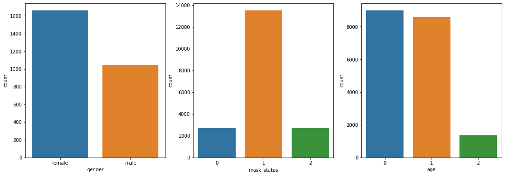
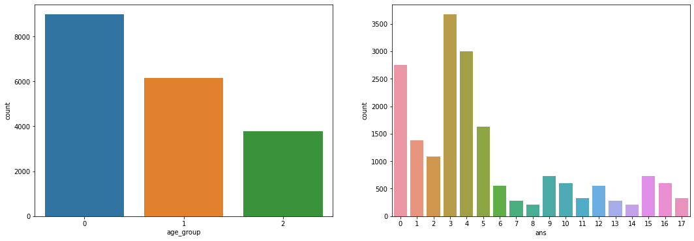
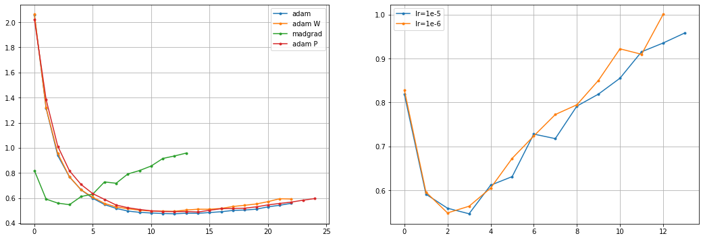

# [Stage 1] Wrap-up Report

**홍승우 T1226**

*April, 2021 - Boostcamp AI Tech*

❗️ **운영진 측에서 해당 대회 데이터 셋의 저작권에 대해 재차 강조하셔서 최대한 직접적인 EDA 나 데이터 노출은 본 리포트에서 제외 하였습니다.**

---

## 📂 문제 정의와 데이터셋

P-Stage 대망의 첫번째 대회는 코로나 시대의 마스크를 주제로 하는 이미지 다중 클래스 분류 문제를 해결하는 과제 였다. 인물 이미지 입력에 대해 마스크 착용 여부, 나이대, 성별을 종합하여 18 가지 클래스로 분류해내야 했다. 대회 기간은 약 2주 였으며, 서버 환경에서 V100 GPU 1장을 사용하여 학습하였다.

- **클래스별 세부 정의**
    - Correct (완전 착용) / Incorrect (불완전 착용) / No mask (미착용)
    - Male / Female
    - 30 세 미만 / 30 세 이상 60 세 미만 / 60 세 이상
- **평가 지표**
    - Macro F-1 Score

데이터셋은 총 4500명이 마스크를 정상 착용한 사진 5장, 불완전하게 착용한 사진 1장, 미착용 1장, 총 31500장의 이미지로 구성되어 있었으며, 이 비율은 모든 데이터셋 구성원에 대해서 동일하게 유지되었다. 결측 이미지나 손상 이미지는 없는것으로 나타났으며 확장자는 jpg, png, jpeg 등의 포맷이 사용되었다.

- Train data (60%)
- Test data (Private (20%) + Public (20%)

학습 데이터와 평가 데이터엔 모두 이미지 한장에 한 사람만 있으며, 촬영 구도 또한 데이터셋 전반에 거쳐 균일 하였다.

초기에 18개의 클래스를 한번에 학습 시키는것은 어렵지 않을까 하는 생각으로 부터 마스크, 성별, 연령대를 예측하는 모델을 각 하나씩 만들어 결과를 조합하여 제출하는 형식으로 방향을 잡게 되었다. 또한, 세가지 task 중 가장 잘 되지 않는 모델만 부분적으로 튜닝하면 될 것 같다는 생각 역시 했던 것 같다.

---

## 📊 Label 분포에 따른 PyTorch 데이터셋 제작과 모델링 검증 전략

### Label 분포 알아보기



우선, 마스크 클래스의 경우 동일 인물이 종류가 다른 마스크를 끼고 총 5장의 사진을 찍고 불완전 착용, 미착용 이미지 각 1장씩 5:1:1 의 비율이 유지가 된다. 모델을 나눠서 학습시킬 전략을 짠 만큼, 마스크 모델을 만들 때 위와 같은 비율이 그대로 들어가게 되면 불균형 문제가 있을 수 있었다. 따라서, 마스크 데이터셋의 경우 __getitem__ 부분을 구현 할 시, 마스크 착용 레이블의 경우 임의로 5장 중 1장의 이미지를 선택하여 loader 로 넘겨주도록 설정하였다. On-line data augmentation 과 undersampling 을 합친것과 비슷하게 학습 이미지를 최대한 모두 활용하면서 클래스 균형 또한 맞춰줄 수 있게 되었다.

Class imbalance 문제는 연령대 예측에서 심하게 나타났다. 데이터를 더 수집해오거나, under / over sampling 기법을 사용하기 보다는 기존 60세의 기준을 57세로 curve 를 주어 라벨링을 해주었다. 성별이나 연령 모델에 사용할 데이터셋의 경우, 마스크 착용에 대한 비율은 그대로 유지되므로 앞서 소개한 방법을 사용하지 않고 모든 이미지를 곧바로 사용하도록 디자인 하였다.

### 연령대에 curve 를 적용한 후 분포 확인



위 플롯은 기존 60세를 기준으로 나누었던 데이터셋을 57세로 커브를 주어 적용한 후의 연령대 분포와 총 18개 클래스의 분포를 나타낸다.

### Image Processing & Data Augmentation

```python
transforms.Compose([transforms.CenterCrop(350),
	                  transforms.Resize((224, 224)),
		                transforms.RandomHorizontalFlip(),
		                transforms.RandomChoice([
		                    transforms.RandomAffine(degrees=3),
		                    transforms.ColorJitter(0.1, 0.1, 0.1, 0),
		                        ]),
		                transforms.ToTensor(),
		                transforms.Normalize((0.548, 0.504, 0.479), (0.237, 0.247, 0.246)),])
```

평가용 데이터셋을 들여다 본 후, augmentation 을 심하게 할 필요는 없을것이라고 생각했다. 이유는, 위에서 언급한 바 와 같이 촬영 구도가 매우 유사했기 때문이다. 다양한 image augmentation 을 적용한다면 overfitting 이나 generalization 에 도움을 줄 순 있겠지만, 단순히 이 대회에서 점수를 높이기 위해 다양한 augmentation 을 할 필요는 cost 적 측면이나 평가적인 측면에서 불필요하다고 생각했다. Normalize 에 사용된 값은, 멘토님들이 토론 게시판의 eda 로부터 찾아주신 값들을 사용하였다. Center Crop 에 관하연 뒷부분에서 얼굴 인식과 함께 다시 언급하도록 하겠다.

제출을 위한 추론과 검증 시, CenterCrop, Resize, Normalize, 텐서변환 만 처리하여 loader 로 보내지도록 설정하였다.

### 모델링 검증 전략

이번 과제의 경우 cross validation 은 사용하지 않았다. 검증을 위해 같은 사람이 학습 데이터와 검증 데이터에 모두 들어가 있는 경우, 모델이 치팅할 수 있기 떄문에 사람을 id 별로 먼저 확실히 나누고 작업하였다. 이후, 성별과 연령대 모델에 학습될 데이터셋의 경우 각 클래스를 stratify 하여 학습 데이터와 검증 데이터를 나누게 되었다.

- Train / valid split size = 85% / 15%
- Random seed = 156

---

## 🧮 Architectures & Training

### Pre-trained Models

공개된 여러가지 backbone 네트워크들을 선택할 수 있지만 처음에 가장 먼저 시도해보는 네트워크는 MobileNetv2 이다. 안드로이드 스마트폰에 들어갈 만큼 가벼운 네트워크지만 언제나 베이스라인으로써 믿음직한 성능을 내주는 MobileNetv2 를 이용하여 이번 역시 실현 가능성을 확인했다.

최종 제출 까지 주력적으로 fine tune 해 나간 모델들은 다음과 같다.

- EfficientNet (B0, B1, B2, B3)
- DenseNet-121
- ResNext-50

모두 pre-trained 된 모델들을 사용하였으며, 분류를 위한 마지막 레이어만 필요한 클래스에 맞게 바꿔 사용하였다. 무거운 FC layer 들을 뒤에 쌓는것은 불필요하다고 생각해 하나만 사용하였으며, layer freezing 은 사용하지 않았다.

### Loss

모두 categorical cross entropy 를 사용했다. 연령대 모델에서 F1-Loss 를 사용해서 학습해보았지만 성능이 매우 좋지 못하였다. (LB 0.4)

> *The best loss function would be, of course the metric itself. Then the misalignment disappears. The macro F1-score has one big trouble. It's non-differentiable. Which means we cannot use it as a loss function.
But we can modify it to be differentiable. Instead of accepting 0/1 integer predictions, let's accept probabilities instead. Thus if the ground truth is 1 and the model prediction is 0.4, we calculate it as 0.4 true positive and 0.6 false negative. If the ground truth is 0 and the model prediction is 0.4, we calculate it as 0.6 true negative and 0.4 false positive.
Also, we minimize 1-F1 (because minimizing 1−f(x) is same as maximizing f(x) ) [https://www.kaggle.com/rejpalcz/best-loss-function-for-f1-score-metric](https://www.kaggle.com/rejpalcz/best-loss-function-for-f1-score-metric)*

대회의 평가 지표가 F1 스코어 이므로 단순히 목적 함수를 F1 으로 두어 최적화 하면 되지 않느냐 하는 질문엔 위의 글에서 답을 찾을 수 있었다. F1 스코어는 미분이 불가능하여 위와 같은 트릭을 사용하여 loss 를 만들어줘야 한다. 학습과정에서 수렴점을 찾지 못한건지, 결과가 너무 좋지 않아 폐기하였다. 나중에 피어 세션에서 들은 건데, 상위권 분 중 F1 loss 와 cross entorpy loss 를 가중 합 하여 사용하셨다고 한다. 이전에 한 논문을 구현해 봤을 때, 최적화 하고자 하는 세가지 각 loss 를 더하여 end-to-end training 한 기억이 나는데, 그러한 점을 미뤄 보면 loss 값을 가중합 하여 최적화 하는것은 굉장히 합리적인 접근이라고 생각했다.

### Ensemble

각 class 별로 모델이 예측한 확률을 평균내어 최종 분류 class 를 선택하는 soft voting 방법을 사용했다. 별도의 가중치는 두지 않았다. EfficientNet B3, DenseNet 121, ResNext-50 각각의 모델을 제출해본 결과, LB 스코어는 각 0.69, 0.67, 0.68 에서 앙상블하여 0.70 으로의 향상이 있었다. 

### Stochastic Weight Averaging (SWA)

- [https://www.youtube.com/watch?v=C0vnmsGIOEo&t=395s&ab_channel=YouHanLee](https://www.youtube.com/watch?v=C0vnmsGIOEo&t=395s&ab_channel=YouHanLee)
- [https://pytorch.org/blog/pytorch-1.6-now-includes-stochastic-weight-averaging/](https://pytorch.org/blog/pytorch-1.6-now-includes-stochastic-weight-averaging/)

**CV 0.72 → 0.74, LB 0.69 → 0.71**

지정된 epoch 뒤로 weight 의 평균을 내어 앙상블 처럼 새로운 weight 를 얻을 수 있는 SWA 를 넣어 사용해봤다. 구현이 간단 하였고, 마치 앙상블 한 것 처럼 일반화 성능이 올라가는것 같다. Validation 데이터와 2% 정도의 성능 향상이 있었다. 시간이 더 있었다면, 몇번째 epoch 부터 적용해야 적절할지에 대한 실험을 해보았을 텐데, 그부분이 아쉽다.

### Optimizer



위 플롯들은 optimizer 별 성능 차이를 실험해 보기 위해 모델을 나누지 않고 같은 세팅에서 실험해 본 결과 이다. 왼쪽 플롯은 learning rate=1e-5 에서 Adam, AdamW, AdamP, Madgrad 를 실험한 결과이다. Madgrad 의 경우 learning rate=1e-5, 1e-6 두가지의 경우를 실험하여 오른쪽에 플롯으로 나타내었다.

- EfficientNet B3
- Batch size = 64
- SWA used
- No learning rate scheduler
- Early stopping patient = 10

우선, Adam, Adam W, Adam P 큰 차이를 보이지 않았다. 대부분 10~13 epoch 사이에서 수렴한것으로 보여진다. 반면 Madgrad 의 경우, 굉장히 빠른 수렴속도를 보여 learning rate 을 너무 크게 줬나 하고 1e-6 으로 실험해봤으나 큰 차이를 보이진 않았다. 빠른 수렴속도를 보이지만, valid loss가 Adam 계열에서 보인 0.5 초반대 까지 떨어지진 못하였다. 좀 더 학습 데이터가 큰 상황에서 나중에 써보면 좋을것 같다. 

---

## 💢 시도 하였지만 실패한 방법들

### 외부 얼굴 인식 모델을 활용한 Crop 전처리

- [https://github.com/timesler/facenet-pytorch](https://github.com/timesler/facenet-pytorch)
- [https://medium.com/@vinuvish/face-detection-with-opencv-and-deep-learning-90bff9028fa8](https://medium.com/@vinuvish/face-detection-with-opencv-and-deep-learning-90bff9028fa8)

클래스를 분류하는데 중요한 부분은 얼굴 이라 생각하여, 얼굴 부분만 크롭 하여 학습 데이터로 사용하면 어떨까 생각했다. 물론 얼굴 부분만 크롭 되어 학습한다면, 추론 과정에서도 같은 방법을 사용해야 기대한 효과를 낼 수 있을 것이다. 얼굴 인식 방법엔 여러가지가 있지만, 간편하고 정확하게 사용할 수 있는 딥러닝 기반 모델을 사용했다. 먼저 MTCNN 얼굴 인식 모델을 불러와 크롭을 진행하였다. 크롭 후 약 2-300여장의 결측치가 있었고, 이것들을 버리기엔 아까운 상황이라 또다른 인식모델을 찾아서 누락치에 대해 인식을 시도한 결과, 누락 수를 27장 까지 줄일 수 있었다.

크롭된 이미지에 대해서만 학습을 진행한 결과, 예상과 다르게 오히려 리더보드 점수가 0.06 하락하였다. (DenseNet 121 단일 모델 사용) Eval 데이터에서 역시 크롭을 진행할 때 누락된 부분이 있었고 그러한 이미지들은 원본 이미지로 대체 하였고, 정확한 예측에 방해가 됐을 것이다. 또한 예측이 잘못 되어 특정 이미지 부분만 지나치게 확대되어 학습된 경우도 있었다.

### 나이 예측은 외부 모델에 맡겨보자

- [https://data-flair.training/blogs/python-project-gender-age-detection/?fbclid=IwAR1d43CEOg-5dnzxPTxE06uB60leOzBKe30bRZewVvsM88V7v6TmTN9GDYI](https://data-flair.training/blogs/python-project-gender-age-detection/?fbclid=IwAR1d43CEOg-5dnzxPTxE06uB60leOzBKe30bRZewVvsM88V7v6TmTN9GDYI)

딥 러닝 분야에서 나이 예측은 따로 대회나 연구 주제로 존재할 만큼 어렵고 중요한 문제라고 생각했다. 따라서 데이터 불균형과 시간적 여유가 부족한 상황에서 이미 나이 예측만을 위해 만들어진 모델을 가져와 대체할 수 있다는 접근을 하게 되었다. 하지만 결과는 대실패였다. 우리 데이터셋으로 직접 만든 모델의 경우 LB 에서 0.6 정도의 F1 스코어가 나오던 와중에, 나이 예측 모델만 대체하였을 때, 0.3점대로 하락하였다. 예상되는 이유는, 사용한 외부 모델의 성능이 동양인 나이대에 특화 되어 학습되지 않았다는점, 마스크로 인해 얼굴이 많이 가려져 예측이 어려웠던 점 등을 꼽을 수 있을 것 같다.

사실 평가 시 마스크 때문에 얼굴이 가려져 있는건 직접 제작한 모델 역시 똑같이 겪는 상황인데, 그렇다면 우리 모델은 얼굴의 주름 뿐 아닌 머리와 옷차림 등을 같이 고려 할 수 도 있겠다고 생각해봤다. 반면, 위 모델은 기본적으로 얼굴을 크롭 후 나이를 예측하기 때문에, 옷차림과 같은 정보는 고려할 수 없다.

---

## 🧾 Retrospect

### 피어 세션

우려와는 다르게 매일 매일 피어 세션의 퀄리티가 좋아졌다. 아무래도 작업 초반엔 별로 공유할 부분이 많지 않지만, 각자 베이스라인을 완성하고 튜닝해 나가는 이후론 여러가지 시도에 대한 이야기가 오고가서 좋았다. 특히, 한번은 실수를 하고 진행하던 부분이 있었는데, 피어 세션에서 만난 분들이 감사하게도 오류를 지적해주셔서 엄청난 시간을 아낄 수 있었다. 고득점을 위해 실용적인 시도를 하셨던 캠퍼 분들도 계셨고, 본인의 공부를 위해서 실험을 설계하여 진행하신분들 또한 만날 수 있었다.

### 아쉬웠던 점

우선, 버전관리를 제대로 하지 못했던것 같다. 피어 세션에서 wandb 나 넵튠 같은 대쉬보드를 사용하신 분들이 많았는데, 다음 대회부터 사용해봐야겠다고 느꼈다. 초반에 빠르게 제출을 한번 해본 뒤로는, 튜닝 계획을 상세하게 짜고 적절하게 다른 요소들을 통제하면서 진행 해야겠다고 생각했다.

파이썬 프로젝트를 처음 만들어서 진행해봤는데, argparser 같은 옵션은 아직 익숙하지 않아 노트북에서 import 해서 돌리는 방식을 주로 사용했었다. 편리했던 부분은, keras 를 사용하듯이 내가 wrap 해놓은 부분은 간단하게 호출해서 사용하기 좋았다. 하지만 엔지니어링 측면에서 처음부터 많이 고려했더라면, 코드 수정 / 추가 를 하기에도 훨씬 용이 했을 것 같다.

- Argparser 더 공부해서 config 세팅 용이하게 하기
- 프로젝트 structure 에 대한 고찰을 더 해보기

다양한 시도를 해봤지만, 성능이 잘 오르지 않았다. 돌려보지 않으면 모르는 딥러닝이라 하지만, 각 시도들에서 성능이 왜 오르지 않았는지 더욱 생각해봤어야 했다. 이곳 저곳에서 본 방법들이라 그냥 갖다 써본 것들이 많았는데, 하나를 사용하더라도 그 방법에 대한 깊은 이해를 바탕으로 사용했다면 모델 성능에 도움이 되었을 수 있었을 것이라 생각한다.

[그동안의 시도들](https://www.notion.so/b65bea23336a4b9f95230aa635caf0e8)
